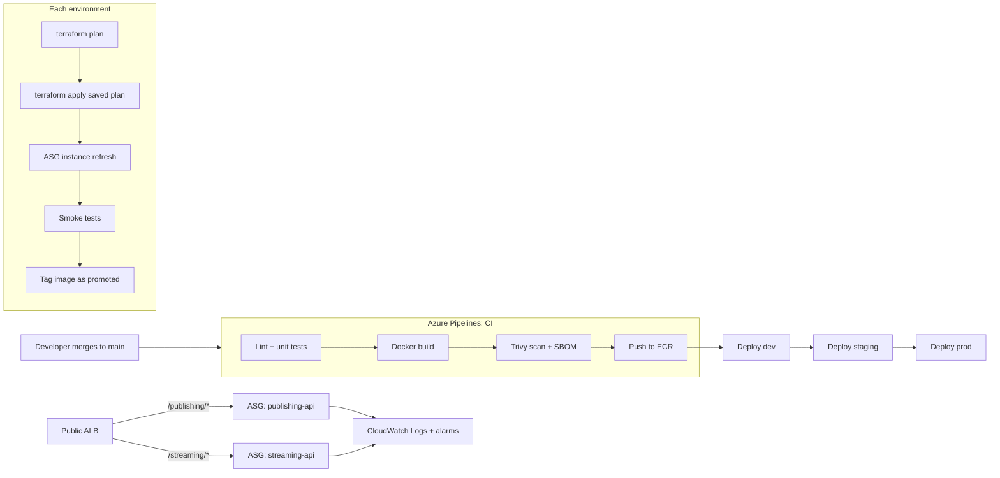

# Media Granite Grid: AWS Delivery Platform

An automated release path for two Node.js services (a content **publishing API** and a **streaming API**) on AWS. A merge to `main` runs tests, scans the image, and deploys through dev, staging and prod with an immutable rollout and automatic rollback.

> **Status:** personal portfolio project. The pipeline, Terraform and services are written and validated locally (unit tests, lint, `terraform validate`). They have not been deployed to a live AWS account.

## Architecture



Traffic flow: **ALB** (public subnets) → path-based routing → **EC2 Auto Scaling groups** (private subnets, 2 to 3 AZs). Each instance pulls the exact image tag from ECR and runs it with Docker.

## Key design decisions

| Decision | How it works |
|---|---|
| **Build once, promote** | One image tag (`build-<id>`) moves dev → staging → prod. No rebuilds, so what was tested is what ships. |
| **Immutable rollout** | A new image creates a new launch template version. The ASG instance refresh starts new instances, waits until they are healthy, then removes the old ones (`min_healthy_percentage = 100`). |
| **Automatic rollback** | The instance refresh is tied to a CloudWatch 5xx alarm. If it fires, the ASG rolls back. |
| **Promotion gates** | Staging requires the image to carry `dev-passed-<id>`; prod requires `staging-passed-<id>`; prod also needs a manual approval. |
| **Plan, then apply** | `terraform plan` is saved as an artifact for review. Apply uses that exact plan file. |
| **Security scanning** | Trivy fails the build on fixable HIGH/CRITICAL CVEs. An SBOM (Syft, CycloneDX) is generated and scanned with Grype. |
| **Version smoke test** | After deploy, `/version` must return the new image tag, which proves the new build is the one serving traffic. |
| **Least privilege** | One IAM role per service: ECR pull, its own log group, its own secret only. IMDSv2 enforced, instances in private subnets, only the ALB can reach them. |
| **Secrets** | Stored in AWS Secrets Manager and read at container start. They never appear in the pipeline, the image or Terraform state. |

## Repository layout

```
azure-pipelines.yml        # CI + three deployment stages
templates/deploy-env.yml   # reusable plan/apply/refresh/smoke-test template
services/
  publishing-api/          # Node.js service, tests, Dockerfile
  streaming-api/           # Node.js service, tests, Dockerfile
infra/                     # Terraform: VPC, ALB, ASG, IAM, ECR, alarms
  envs/                    # dev / staging / prod variable files
scripts/                   # wait-instance-refresh, smoke-test, rollback, install-terraform
```

## Try it locally

```bash
# Run a service's lint and tests
cd services/publishing-api
npm ci && npm run lint && npm test

# Validate the Terraform (no AWS account needed)
cd ../../infra
terraform init -backend=false
terraform validate
```

## Rollback

| Situation | What happens |
|---|---|
| Scan or test fails | Nothing is pushed. |
| 5xx alarm during rollout | The ASG automatically restores the previous launch template version. |
| Smoke test fails | The stage fails and the image is not promoted. |
| Problem found later in prod | Re-run the prod stage of the last good pipeline run. |

## What I would improve next

- Bake AMIs with Packer so scale-out is faster.
- Add image signing (cosign) and verify signatures at deploy time.
- Add CloudWatch synthetic canaries for continuous production checks.
- Serve HTTPS with an ACM certificate (the `certificate_arn` variable already supports it).
